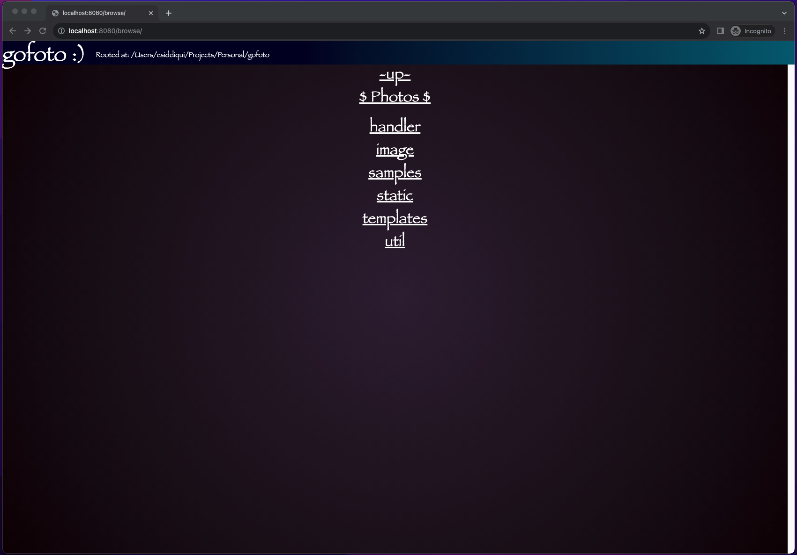
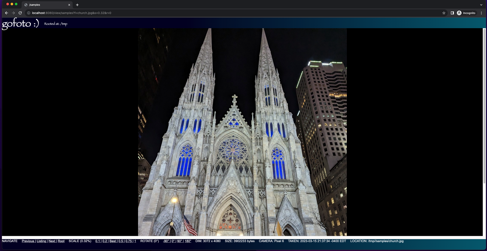

# gofoto

A web-based photo viewing server written in Go to browse, view, resize & rotate images from the local file system.

Currently only CR2 (Canon Raw) format & JPEG encoding is supported.

## Build:

```
% make build 
```

## Run:

The `run` target builds & executes the `gofoto` server rooted at the filesystem path `$HOME`.

```
% make build run 
```

To specify a different path, pass it in as command-line parameter.

```
% ./gofoto /path/to/start
```

If no path is supplied, it will set root at current user's home pointed by `$HOME` env var

## How to use:

After the server has started successfuly, point your browser to `http://localhost:8080/`

The browser view displays a list of all sub-directories, a link to go `~up~` a level or view the pictures in the current directory `$ photos $`



The photo viewer page lets you view, resize or rotate images using the link at the bottom of the page.



